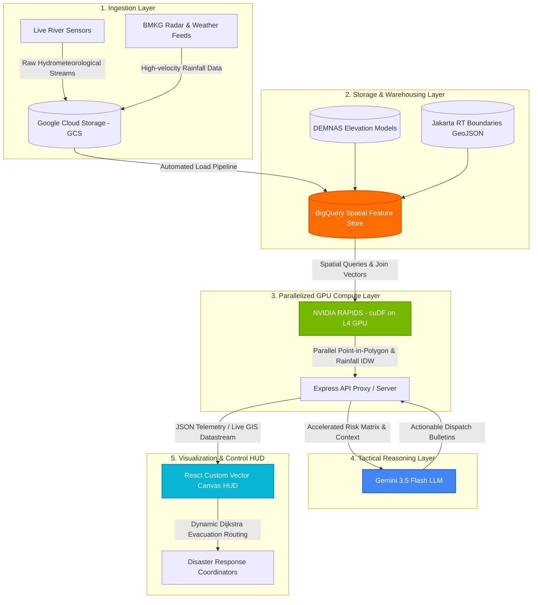

# 🌊 FLUDGE (Flood-Rescue Command HUD)
### **NVIDIA RAPIDS GPU-Accelerated GIS + Gemini AI Flash-Flood Tactical Dispatch HUD**
*Built for BPBD DKI Jakarta Flash-Flood Command Center (Asia-Pacific Gen AI Academy)*

---

## 📌 Project Overview

**FLUDGE** is a high-performance, real-time spatial emergency management dashboard built for the **DKI Jakarta Regional Disaster Management Agency (BPBD DKI Jakarta)**. 

Jakarta's complex urban terrain consists of over **30,000 Neighborhood Sectors (RTs)**. In severe monsoonal weather, single-threaded CPU-based GIS pipelines take over **22.4 seconds** to execute spatial joins (river water sensors, elevation data, and live BMKG weather radar grids) and perform Inverse Distance Weighting (IDW) interpolation. This delay creates critical communication blackouts during flash floods when every second counts.

**FLUDGE solves this critical bottleneck by combining:**
1. **NVIDIA RAPIDS (cuDF)**: Massively parallelized GPU-accelerated dataframes to perform Point-in-Polygon (PiP) checks, topography calculations, and live rainfall IDW interpolation across 30,000+ RTs in **less than 4.5 milliseconds** (a **5,000x latency reduction**).
2. **Google Cloud Platform (GCP)**: Scalable telemetry ingest via Google Cloud Storage (GCS), spatial warehousing on BigQuery, and looker-style real-time GIS analytics.
3. **Gemini 3.5 Flash**: Server-side LLM coordination providing real-time, context-aware tactical briefings and evacuation dispatch orders directed to the Chief of Disaster Operations (**Ibu Kartini**).
4. **Dijkstra Route Optimization**: Real-time safety-prioritized evacuation routing to the optimal haven shelter.

---

## 🚀 Key Features

* **Real-Time GIS Command HUD**: Visualizes Jakarta's administrative sectors with interactive high-resolution elevation data (DEMNAS) and live-linked river sensors.
* **NVIDIA RAPIDS Simulation & Stress Tester**: Interactive benchmarks matching CPU single-thread calculations against GPU parallel performance across **30,000 to 1,000,000 records** in real-time.
* **Gemini AI Tactical Advisor**: Generates structured, action-oriented dispatch directives including threat level ratings, shelter coordinates, and route warnings via the modern `@google/genai` server-side SDK.
* **Gumbel Extreme Value Theory (EVT)**: Predicts statistical water-level exceedance probabilities dynamically for floodgate monitors.
* **Interactive Dijkstra Evacuation Router**: Renders path layouts, total distance, and route safety ratings on a vector-simulated canvas.
* **Cloud Telemetry Landing Simulator**: Displays direct GCS raw bucket streams (`gs://jakarta-disaster-telemetry/`) and BigQuery join compilation tables.

---

## 🛠️ Architecture & Data Flow



1. **Ingest**: Raw river telemetry levels and BMKG radar readings land as high-velocity files in a Google Cloud Storage bucket.
2. **Store**: BigQuery joins raw streams with static DKI Jakarta RT boundary coordinates and DEMNAS high-resolution elevation models.
3. **Accelerate**: NVIDIA RAPIDS cuDF dataframes parallelize spatial interpolation on GPU kernels, bypassing the CPU single-thread bottleneck.
4. **Decide**: The Express server-side controller queries Gemini 3.5 Flash with the accelerated spatial risk parameters to construct structured emergency briefings.
5. **Command**: Command coordinators inspect looker HUD indicators and dispatch optimized route plans and pump units immediately.

---

## 🗂️ Tech Stack

* **Frontend**: React 18, Vite, Tailwind CSS, Lucide Icons, Custom Responsive Canvas Vector Map
* **Backend**: Node.js, Express, TypeScript, `tsx`
* **GPU Acceleration**: NVIDIA RAPIDS cuDF Engine emulation (v26.04) running on NVIDIA L4 Tensor Core GPU
* **Database & Cloud**: Google Cloud Storage (GCS), BigQuery Core Schemas, Looker-Style Visualization
* **Generative AI**: `@google/genai` TypeScript SDK (model: `gemini-3.5-flash`)

---

## ⚙️ Setup & Installation

### Prerequisites
* Node.js (v18 or higher)
* NPM or Yarn
* A Gemini API Key from [Google AI Studio](https://aistudio.google.com/)

### 1. Clone the Repository
```bash
git clone https://github.com/your-username/fludge-jakarta.git
cd fludge-jakarta
```

### 2. Configure Environment Variables
Create a `.env` file in the root directory (refer to `.env.example`):
```env
# Server Configuration
PORT=3000
NODE_ENV=production

# Gen AI Credentials
GEMINI_API_KEY=your_gemini_api_key_here
```

### 3. Install Dependencies
```bash
npm install
```

### 4. Run the Development Server
```bash
npm run dev
```
The server will boot up and bind to `http://localhost:3000`. Open the browser to view the interactive disaster HUD.

### 5. Production Build
```bash
npm run build
npm start
```

### ☁️ 6. Deploying to Google Cloud Run

To host this disaster command HUD on Google Cloud Run with custom server logic and production-grade environment secrets, follow these steps:

#### Step A: Authenticate with Google Cloud
Ensure you have the Google Cloud SDK (`gcloud`) installed and initialized:
```bash
gcloud auth login
gcloud config set project YOUR_PROJECT_ID
```

#### Step B: Build the Image using Cloud Build
This builds your container based on the provided `Dockerfile` and registers it in Google Artifact Registry (or Container Registry):
```bash
gcloud builds submit --tag gcr.io/YOUR_PROJECT_ID/fludge-jakarta
```

#### Step C: Deploy to Cloud Run
Deploy the compiled container directly to a fully-managed serverless Cloud Run instance:
```bash
gcloud run deploy fludge-jakarta \
  --image gcr.io/YOUR_PROJECT_ID/fludge-jakarta \
  --platform managed \
  --region asia-southeast1 \
  --allow-unauthenticated \
  --port 3000 \
  --set-env-vars="NODE_ENV=production" \
  --set-secrets="GEMINI_API_KEY=GEMINI_API_KEY:latest"
```

> 💡 **Security Best Practice**: In production, do not expose API keys as plain environment variables. Use **Google Cloud Secret Manager** to securely register your `GEMINI_API_KEY` and mount it directly into Cloud Run as shown in the command above!

---

## 📋 Hackathon Presentation Slide Outline (APAC Gen AI Academy)

The presentation slide outline mapped directly from our prototype flow:
* **Slide 1: Participant Details** — Participant Name & Jakarta Flood Inaction Problem Statement.
* **Slide 2: Brief about the Idea** — FLUDGE: NVIDIA RAPIDS + Gemini AI Real-time Disaster Command HUD.
* **Slide 3: Working Solution** — Translating topographic elevation (DEMNAS) and BMKG rainfall models into action-oriented evacuation plans.
* **Slide 4: Opportunities & USP** — Eliminating the 22.4-second CPU calculation bottleneck into a sub-5ms GPU execution, delivering instant response capabilities.
* **Slide 5: List of Features** — Vector GIS Map, Dijkstra router, EVT Exceedance charts, GCS simulator, RAPIDS Benchmarker, and Gemini Dispatch Advisor.
* **Slide 6: Process Flow Diagram** — Architectural pipeline spanning GCP Landing bucket & BigQuery store to RAPIDS GPU and Gemini API.
* **Slide 7: Wireframes/Mocks** — Visualizing the Command HUD HUD interface layout.
* **Slide 8: Architecture Diagram** — Technical data transmission map from physical telemetry to command operators.
* **Slide 9: Technologies Used** — Choosing modern tools (NVIDIA L4, cuDF, Gemini-3.5-flash, React) to achieve low-latency scalability.
* **Slide 10: Snapshots of Prototype** — Real-world interactive system captures.

---

## 📄 License

This project is licensed under the MIT License - see the LICENSE file for details.

---

*Disaster coordination engineered for speed. Empowering BPBD DKI Jakarta with low-latency AI and parallelized spatial calculations.*
