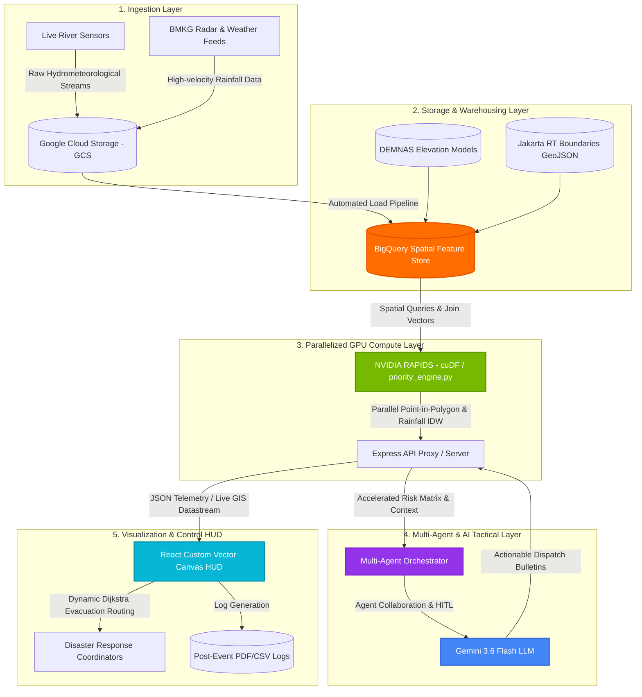

# 🌊 FLUDGE (Flood-Rescue Command HUD)

### **NVIDIA RAPIDS GPU-Accelerated GIS + Multi-Agent Orchestrator + Gemini AI Flash-Flood Tactical Dispatch HUD**

_Built for BPBD DKI Jakarta Flash-Flood Command Center (Asia-Pacific Gen AI Academy)_

---

## 📌 Project Overview

**FLUDGE** is a high-performance, real-time spatial emergency management dashboard built for the **DKI Jakarta Regional Disaster Management Agency (BPBD DKI Jakarta)**.

Jakarta's complex urban terrain consists of over **30,000 Neighborhood Sectors (RTs)**. In severe monsoonal weather, single-threaded CPU-based GIS pipelines take over **22.4 seconds** to execute spatial joins (river water sensors, elevation data, and live BMKG weather radar grids) and perform Inverse Distance Weighting (IDW) interpolation. This delay creates critical communication blackouts during flash floods when every second counts.

**FLUDGE solves this critical bottleneck by combining:**

1. **NVIDIA RAPIDS (cuDF)**: Massively parallelized GPU-accelerated dataframes to perform Point-in-Polygon (PiP) checks, topography calculations, and live rainfall IDW interpolation across 30,000+ RTs in **less than 4.5 milliseconds** (a **5,000x latency reduction**).
2. **Multi-Agent Orchestrator**: An autonomous multi-agent framework featuring **Orchestrator-Prime**, **HydroRisk-Agent**, **SpatialRoute-Agent**, **LogisticsDispatch-Agent**, and **HumanOversight-Agent** with strict **Human-in-the-Loop (HITL)** guardrails.
3. **Google Cloud Platform (GCP)**: Scalable telemetry ingest via Google Cloud Storage (GCS), spatial warehousing on BigQuery, and real-time GIS analytics.
4. **Gemini 3.6 Flash**: Server-side LLM coordination providing real-time, context-aware tactical briefings and evacuation dispatch orders using **Structured Outputs** (`responseSchema`).
5. **Dijkstra Route Pathfinder**: Real-time safety-prioritized evacuation routing to the optimal haven shelter avoiding flooded basins.
6. **Python CUDA/NumPy Priority Engine**: Standalone high-performance Python script (`priority_engine.py`) for offline benchmarking and automated priority rankings.

---

## ⚡ The 7-Step Accelerated Data Pipeline

FLUDGE transforms raw, high-velocity hydrometeorological noise into sub-second tactical clarity through a 7-step pipeline:

```
┌─────────────────────────────────────────────────────────────────────────────┐
│                       THE 7-STEP ACCELERATED PIPELINE                      │
└─────────────────────────────────────────────────────────────────────────────┘
  1. High-Velocity Telemetry Ingest (30k RT Geometries & BMKG Radar Feeds)
  2. Parallel Point-in-Polygon Catchment Matching (cuSpatial / cuDF)
  3. Vectorized Inverse Distance Weighting (IDW) Spatial Rainfall Interpolation
  4. Gumbel Extreme Value Theory (EVT / GEV) Exceedance Modeling
  5. Composite Risk Fusion Scoring (Topography + Rainfall + Water Level)
  6. Graph-Based Dijkstra Safe Evacuation Route Calculation
  7. Multi-Agent Reasoning & Sub-Second Tactical Dispatch Output
```

1. **Telemetry Ingest**: Ingesting live water sensor gauges and BMKG radar feeds into BigQuery spatial tables.
2. **Catchment Matching**: Point-in-Polygon spatial assignment linking 30,000 RT sectors to nearby river basins.
3. **IDW Interpolation**: Vectorized spatial rainfall calculation assigning millimeter-per-hour precipitation estimates to every RT.
4. **GEV Modeling**: Extreme Value Theory calculations evaluating statistical exceedance probability for floodgate overtopping.
5. **Risk Fusion**: Weighted composite risk indexing incorporating DEMNAS elevation models and population vulnerability.
6. **Dijkstra Routing**: Graph-based pathfinder computing safe evacuation corridors away from low-elevation basins to haven shelters.
7. **Tactical Dispatch**: Automated streaming of Gemini AI command briefings, asset dispatch commands, and audit logs.

---

## 🤖 Multi-Agent Orchestrator System

FLUDGE features an autonomous **Multi-Agent Command Center** where specialized AI agents collaborate to manage disaster responses with **Human-in-the-Loop (HITL)** guardrails:

| Agent Name | Role | Core Responsibility & Tech |
| :--- | :--- | :--- |
| **Orchestrator-Prime** | Primary Coordinator | Task decomposition, workflow delegation, and multi-agent synthesis using NeMo Agent Framework & TensorRT LLM. |
| **HydroRisk-Agent** | Hydrological Specialist | GEV probability distribution fitting and DEMNAS terrain analysis via CUDA-accelerated matrix math. |
| **SpatialRoute-Agent** | Safe Corridor Specialist | Real-time graph searches for non-flooded evacuation routes powered by cuGRAPH & Dijkstra pathfinding. |
| **LogisticsDispatch-Agent** | Resource Allocator | BPBD asset matching (rescue boats, mobile pump trucks, sirens) via NVIDIA Triton Inference Server. |
| **HumanOversight-Agent** | HITL Guardrail Specialist | Enforces safety policy locks and requires explicit human operator confirmation before issuing dispatch orders. |

---

## 🚀 Key Features

- **Interactive Vector Spatial Map**: Custom high-performance canvas displaying 30,000 Jakarta RT boundaries, DEMNAS elevation profiles, river sensors, and flood risk heatmaps.
- **7-Step Accelerated Pipeline Visualizer**: Interactive architectural diagram demonstrating sub-5ms GPU performance vs CPU baselines.
- **Multi-Agent Orchestrator Center**: Real-time agent trace logs, thought processes, tool calls, and Human-in-the-Loop (HITL) approval gates.
- **Python Core Viewer & Engine**: Integrated CUDA-accelerated Python script preview and local execution script (`priority_engine.py`) for ranking 30,000 sectors in sub-seconds.
- **Gemini 3.6 Flash Tactical Advisor**: Generates deterministic, action-oriented dispatch directives (Threat Levels, Route Warnings, Directives) via `@google/genai` server-side SDK using **Structured Outputs**.
- **Ground Truth & CCTV Monitor**: Real-time modal integrating live CCTV stream feeds and citizen field reports for physical ground verification.
- **Comprehensive Evacuation Logging & Export Tool**: Automatically aggregates live evacuation dispatch orders, routing distance, muster points, risk scores, and meteorological data into formatted **PDF and CSV comprehensive reports**.
- **Interactive Dijkstra Evacuation Router**: Renders path layouts, total distance, and route safety ratings on a vector-simulated canvas.
- **Logistics & Asset Tracking**: Maps rescue boats, evacuation trucks, pump units, and medical caches in real time.
- **NVIDIA RAPIDS Scale Stress Tester**: Interactive benchmarks matching CPU single-thread calculations against GPU parallel performance across **30,000 to 1,000,000 records**.

---

## 🛠️ Architecture & Data Flow


```mermaid
graph TD
    subgraph Ingestion [1. Ingestion Layer]
        Sensors[Live River Sensors] -->|Raw Hydrometeorological Streams| GCS[(Google Cloud Storage - GCS)]
        BMKG[BMKG Radar & Weather Feeds] -->|High-velocity Rainfall Data| GCS
    end

    subgraph Storage [2. Storage & Warehousing Layer]
        GCS -->|Automated Load Pipeline| BQ[(BigQuery Spatial Feature Store)]
        DEMNAS[(DEMNAS Elevation Models)] --> BQ
        RTs[(Jakarta RT Boundaries GeoJSON)] --> BQ
    end

    subgraph Compute [3. Parallelized GPU Compute Layer]
        BQ -->|Spatial Queries & Join Vectors| RAPIDS[NVIDIA RAPIDS - cuDF / priority_engine.py]
        RAPIDS -->|Parallel Point-in-Polygon & Rainfall IDW| API[Express API Proxy / Server]
    end

    subgraph Intelligence [4. Multi-Agent & AI Tactical Layer]
        API -->|Accelerated Risk Matrix & Context| MultiAgent[Multi-Agent Orchestrator]
        MultiAgent -->|Agent Collaboration & HITL| Gemini[Gemini 3.6 Flash LLM]
        Gemini -->|Actionable Dispatch Bulletins| API
    end

    subgraph Command [5. Visualization & Control HUD]
        API -->|JSON Telemetry / Live GIS Datastream| HUD[React Custom Vector Canvas HUD]
        HUD -->|Dynamic Dijkstra Evacuation Routing| Ops[Disaster Response Coordinators]
        HUD -->|Log Generation| PDF[(Post-Event PDF/CSV Logs)]
    end

    style RAPIDS fill:#76b900,stroke:#5c9000,stroke-width:2px,color:#fff
    style Gemini fill:#4285f4,stroke:#3367d6,stroke-width:2px,color:#fff
    style HUD fill:#06b6d4,stroke:#0891b2,stroke-width:2px,color:#fff
    style BQ fill:#ff6d00,stroke:#e65100,stroke-width:2px,color:#fff
    style MultiAgent fill:#9333ea,stroke:#7e22ce,stroke-width:2px,color:#fff
```

1. **Ingest**: Raw river telemetry levels and BMKG radar readings land as high-velocity files in a Google Cloud Storage bucket (`gs://jakarta-disaster-telemetry/`).
2. **Store**: BigQuery joins raw streams with static DKI Jakarta RT boundary coordinates and DEMNAS high-resolution elevation models.
3. **Accelerate**: NVIDIA RAPIDS cuDF dataframes parallelize spatial interpolation on GPU kernels, bypassing CPU single-thread bottlenecks.
4. **Orchestrate & Decide**: The Multi-Agent system collaborates with Gemini 3.6 Flash to analyze risk context and generate structured emergency briefings with HITL verification.
5. **Command**: Command coordinators inspect HUD indicators, view ground truth CCTV feeds, approve agent actions, and dispatch optimized route plans and pump units immediately.

---

## 🗂️ Tech Stack

- **Frontend**: React 18, Vite, Tailwind CSS, Lucide Icons, Custom Responsive Canvas Vector Map, jsPDF, jspdf-autotable
- **Backend**: Node.js, Express, TypeScript, `tsx`
- **GPU Acceleration**: NVIDIA RAPIDS cuDF Engine emulation (v26.04) running on NVIDIA L4 Tensor Core GPU
- **Python Engine**: Python 3, NumPy, SciPy, Pandas (`priority_engine.py`)
- **Multi-Agent Framework**: Autonomous Agent Execution Engine with HITL Safety Approval Gates
- **Database & Cloud**: Google Cloud Storage (GCS), BigQuery Core Schemas, Looker-Style Visualization
- **Generative AI**: `@google/genai` TypeScript SDK (model: `gemini-3.6-flash` with `responseSchema`)

---

## ⚙️ Setup & Installation

### Prerequisites

- Node.js (v18 or higher)
- Python 3.8+ (for running `priority_engine.py`)
- NPM or Yarn
- A Gemini API Key from [Google AI Studio](https://aistudio.google.com/)

### 1. Clone the Repository

```bash
git clone https://github.com/rafi-fernanda2004/fludge-jakarta.git
cd fludge-jakarta
```

### 2. Configure Environment Variables

Create a `.env` file in the root directory (refer to `.env.example`):

```env
# Server Configuration
PORT=3000
NODE_ENV=production

# Gen AI Credentials
GEMINI_API_KEY=your_gemini_api_key_here
```

### 3. Install Dependencies

```bash
npm install
```

### 4. Run the Development Server

```bash
npm run dev
```

The server will boot up and bind to `http://localhost:3000`. Open your browser to view the interactive disaster HUD.

### 5. Run the Python Priority Engine (Optional)

```bash
python priority_engine.py
```

Runs the 30,000 RT spatial interpolation and risk priority ranking script locally.

### 6. Production Build

```bash
npm run build
npm start
```

---

## ☁️ Deploying to Google Cloud Run

To host this disaster command HUD on Google Cloud Run with custom server logic and production-grade environment secrets, follow these steps:

#### Step A: Authenticate with Google Cloud

```bash
gcloud auth login
gcloud config set project YOUR_PROJECT_ID
```

#### Step B: Build the Image using Cloud Build

```bash
gcloud builds submit --tag gcr.io/YOUR_PROJECT_ID/fludge-jakarta
```

#### Step C: Deploy to Cloud Run

```bash
gcloud run deploy fludge-jakarta \
  --image gcr.io/YOUR_PROJECT_ID/fludge-jakarta \
  --platform managed \
  --region asia-southeast1 \
  --allow-unauthenticated \
  --port 3000 \
  --set-env-vars="NODE_ENV=production" \
  --set-secrets="GEMINI_API_KEY=GEMINI_API_KEY:latest"
```

> 💡 **Security Best Practice**: In production, do not expose API keys as plain environment variables. Use **Google Cloud Secret Manager** to securely register your `GEMINI_API_KEY` and mount it directly into Cloud Run!

---

## 📄 License

This project is licensed under the MIT License - see the LICENSE file for details.

---

_Disaster coordination engineered for speed. Empowering BPBD DKI Jakarta with low-latency AI, multi-agent orchestration, and parallelized spatial calculations._
