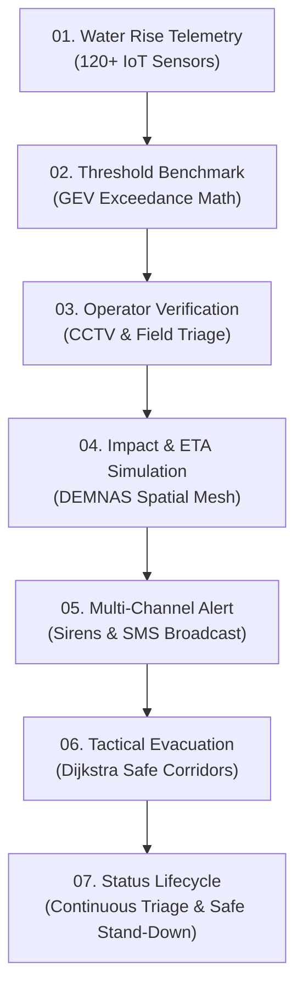

# 🌊 FLUDGE — Premium Landing Page & Operator Intelligence Concept

This document presents the refined design concept and implementation structure for the **FLUDGE** landing page. Built for **BPBD (Badan Penanggulangan Bencana Daerah)** disaster operators, FLUDGE turns complex hydrological telemetry into sub-second, deterministic operational decisions.

---

## 🎨 Design Vision & Aesthetic Direction

Drawing inspiration from high-performance dark-mode command platforms and interactive 3D web experiences (such as *motionsites.ai*, Apple event reveals, and Linear):

- **Palette**: Deep midnight slate (`#070a11`), tactical dark glass overlays (`bg-slate-950/80 backdrop-blur-xl`), and neon telemetry highlights (`#06b6d4` Cyan, `#f59e0b` Amber, `#ef4444` Crimson, `#10b981` Emerald).
- **Interactive 3D Terrain Engine**: Real-time WebGL/HTML5 Canvas isometric wireframe mesh simulating the Jakarta Ciliwung River Basin. Visitors can adjust water elevation levels in real time directly on the landing page hero.
- **Micro-Animations & Motion**: Smooth Framer Motion transitions, glowing radar pulse rings, and interactive step previews.

---

## 🚀 Key Landing Page Sections

### 1. Hero Section & 3D Hydrological Matrix
- **Interactive 3D Canvas**: Renders elevation contour wireframes, animated water waves, and radar pulse nodes for Pintu Air Manggarai, Katulampa, and Pos Cipinang.
- **Live Interactive Slider**: Adjust simulated water elevation to trigger alert status changes (*NORMAL* $\rightarrow$ *SIAGA 3* $\rightarrow$ *SIAGA 2* $\rightarrow$ *SIAGA 1*).
- **Sub-second Freshness Metrics**: Highlight **30,000+ RT sectors**, **0.4s GPU CUDA latency**, and **120 active floodgates**.

---

### 2. The 7-Step BPBD Operational Workflow Pipeline
An interactive step-by-step pipeline section demonstrating the exact workflow of a BPBD duty officer:

| Stage | Title | Key Metric / Capability |
| :--- | :--- | :--- |
| **01** | Telemetry Surge | Streams sensor data every 2 seconds from 120 floodgate nodes |
| **02** | Threshold Benchmark | Evaluates water head against historical GEV return curves |
| **03** | Operator Triage | Integrated live CCTV stream and field report verification |
| **04** | Hydro propagation | Solves affected RT micro-sectors & exact ETA count-downs |
| **05** | Warning Broadcast | Single-click Siren, SMS, and broadcast emergency alerts |
| **06** | Tactical Dispatch | Dijkstra routing for nearest rescue boat & shelter allocation |
| **07** | Life-cycle Monitor | Dynamic triage tracking water recession and safe resolution |

---

### 3. The 7 Critical Operator Decisions Showcase
FLUDGE directly answers the 7 key questions required by BPBD operators during an emergency:

> [!IMPORTANT]
> **Operator Decision Matrix Capabilities**

1. **"Do conditions meet the criteria for issuing an alert?"**
   - 🟢 **Answer**: *YES — Water head reads 840 cm, exceeding 1.42x Siaga 2 safety limit (+15cm/15m rise rate).*
2. **"Which areas will be affected first?"**
   - 📍 **Answer**: *Sub-sectors RT 04, 05, and 08 in Kampung Melayu Ward.*
3. **"How much time remains before the flood reaches those areas?"**
   - ⏳ **Answer**: *14 Minutes 32 Seconds (calculated at 1.8 m/s flow velocity).*
4. **"How many residents need to be evacuated?"**
   - 👥 **Answer**: *1,420 Residents across 385 households (including 244 vulnerable elderly/toddlers).*
5. **"Which shelters still have available capacity?"**
   - 🏥 **Answer**: *GOR Otista (340 seats free) & SDN 01 Kampung Melayu (180 seats free).*
6. **"Which team is closest and ready for deployment?"**
   - 🚤 **Answer**: *Tim Alpha BPBD East (1.2 km away — ETA 4.5 minutes via non-submerged corridor).*
7. **"Should alert level be raised, or lifted if conditions improve?"**
   - 📈 **Answer**: *Maintain SIAGA 2. Upstream rain sustained at 65mm/hr; re-evaluate in 15 mins.*

---

### 4. Technical Architecture Specs
- **[Interactive3DTerrain.tsx](file:///C:/Users/rafif/Fludge/src/components/ui/Interactive3DTerrain.tsx)**: High-performance canvas wireframe 3D renderer.
- **[OperatorWorkflowSection.tsx](file:///C:/Users/rafif/Fludge/src/components/ui/OperatorWorkflowSection.tsx)**: Interactive stage switcher with live HUD preview simulations.
- **[OperatorDecisionMatrix.tsx](file:///C:/Users/rafif/Fludge/src/components/ui/OperatorDecisionMatrix.tsx)**: Real-time decision output matrix.
- **[LandingPage.tsx](file:///C:/Users/rafif/Fludge/src/components/LandingPage.tsx)**: Main landing wrapper uniting 3D hero, pipeline, decision matrix, and launch CTA.

---

## 🛠️ Verification & Next Steps
- Open the application web dev server (`npm run dev`) and test the landing page scrolling, 3D water slider, 7-step pipeline interactive clicks, and decision tabs.
- Click **LAUNCH COMMAND HUD** to seamlessly transition to the live BPBD command tracker interface.
